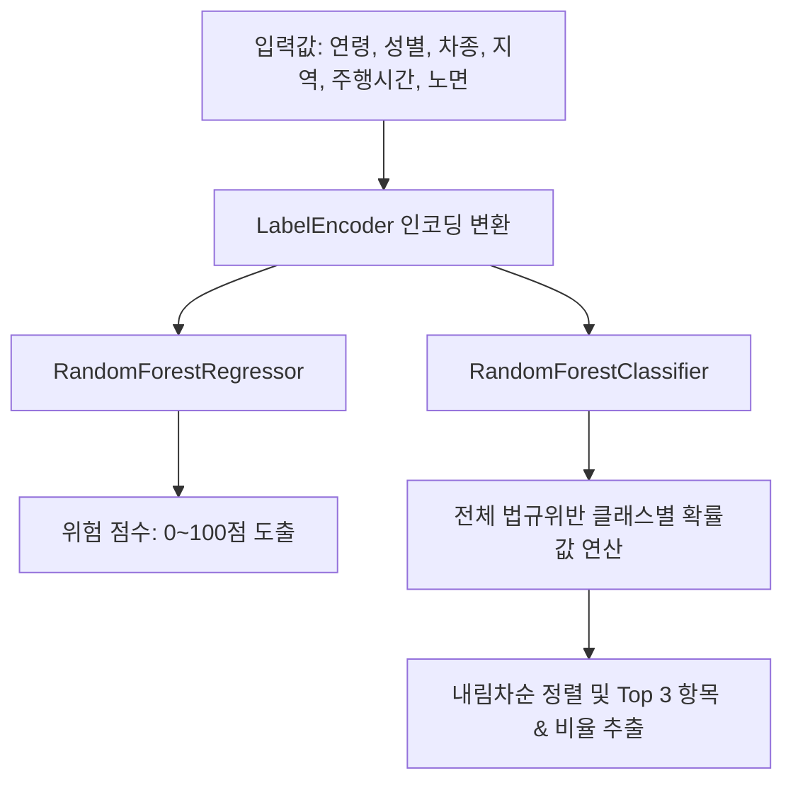

> ⚠️ **보관 문서** — 현재 API 서빙(InsureGuard / GovGuard **v1.0.3**)과 무관합니다.  
> 최신 명세: [ins_v1_0_3_feature_spec.md](../ins_v1_0_3_feature_spec.md), [gov_v1_0_4_feature_spec.md](../gov_v1_0_4_feature_spec.md) · 목차: [README.md](../README.md)

# 교통사고 예측 모델 피처 명세서 (Feature Specification)

본 문서는 대구광역시 교통사고 분석 데이터를 기반으로 학습된 **사고 위험도 예측 모델(Regressor)** 및 **주요 사고 원인 분류 모델(Classifier)**의 입력 피처와 타겟 변수 세부 스펙을 기술합니다.

---

## 1. 모델 입력 피처 (Features)

모델은 예측을 위해 총 6개의 범주형 입력 피처를 사용합니다. 각 피처는 학습 전에 `LabelEncoder`를 통해 고유한 정수형(Int) 데이터로 변환되어 모델에 입력됩니다.

| 피처명 (KO) | 피처명 (EN) | 데이터 타입 | 데이터 형태 | 유효 값 목록 및 예시 | 설명 |
| :--- | :--- | :--- | :--- | :--- | :--- |
| **연령** | `가해운전자 연령대` | String (Categorical) | 범주형 | `20세 이하`, `21-30세`, `31-40세`, `41-50세`, `51-60세`, `61-64세`, `65세 이상` | 사고 가해자의 연령대 카테고리 |
| **성별** | `가해운전자 성별` | String (Categorical) | 범주형 | `남`, `여` | 사고 가해자의 생물학적 성별 |
| **차종** | `가해운전자 차종` | String (Categorical) | 범주형 | `승용`, `화물`, `이륜`, `승합`, `원동기`, `자전거`, `건설기계`, `특수` 등 | 사고를 유발한 차량의 종류 |
| **지역** | `지역` | String (Categorical) | 범주형 | `중구`, `동구`, `서구`, `남구`, `북구`, `수성구`, `달서구`, `달성군`, `군위군` | 대구광역시 내 자치구/군 행정구역명 |
| **주행시간** | `주야` | String (Categorical) | 범주형 | `주간`, `야간` | 사고 발생 당시 시간대 구분 |
| **노면** | `노면상태` | String (Categorical) | 범주형 | `건조`, `젖음/습윤`, `서리/결빙`, `적설`, `기타` | 사고 발생 당시의 도로 노면 노면상태 |

---

## 2. 모델 출력 및 타겟 변수 (Targets)

### 2.1. 위험 점수 예측 (Regression Target)
*   **변수명:** `위험점수` (Risk Score)
*   **데이터 타입:** Float (Continuous)
*   **표시 범위:** 0.0 ~ 100.0 (백분위 기준)
*   **산출 산식 및 가중치:**
    $$\text{심각도} = (\text{사망자수} \times 15) + (\text{중상자수} \times 8) + (\text{경상자수} \times 3) + \text{피해자 상해가중치} + \text{사고유형 가중치}$$
    $$\text{원천위험점수} = \text{심각도} \times \text{사고발생률(그룹별 인구 대비 사고건수)}$$
    $$\text{위험점수} = \text{PercentileRank}(\text{원천위험점수}) \times 100$$
*   **가중치 세부 스펙:**
    *   **사고유형 가중치:** `사망사고`(15), `중상사고`(8), `경상사고`(3), `부상신고사고`(1)
    *   **피해자 상해가중치:** `사망`(15), `중상`(8), `경상`(3), `부상신고`(1), `상해없음`/`기타불명`(0)

### 2.2. 주요 사고 원인 Top 3 분류 (Classification Target)
*   **변수명:** `법규위반` (Violation Type)
*   **데이터 타입:** String (Categorical)
*   **출력 방식:** 다중 클래스 확률 분포 (`predict_proba`) 중 상위 3개 라벨과 매핑된 확률값 표기
*   **예측 대상 클래스 예시:**
    *   `안전운전불이행`
    *   `안전거리미확보`
    *   `신호위반`
    *   `교차로운행방법위반`
    *   `중앙선침범` 등

---

## 3. 학습 및 추론용 데이터 흐름 (Data Flow)

