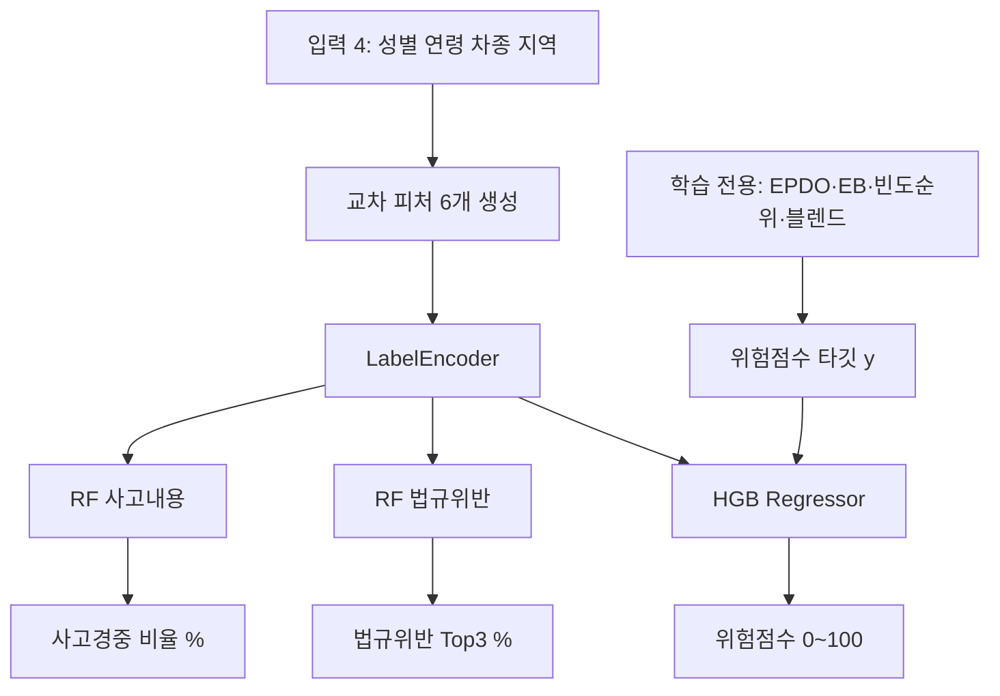

> **보관에 가깝습니다.** 현재 API 서빙은 **v1.0.5**  
> (`docs/ins_v1_0_5_feature_spec.md`, `scripts/ins_v1_0_5.py`) 입니다.

# InsureGuard AI v1.0.4 — 피처 명세서 & R² 해석 가이드

본 문서는 `scripts/ins_v1_0_4.py`로 학습된 **InsureGuard AI v1.0.4**
(`models/ins_model_v1.0.4.pkl`)의 입력·타깃 정의와,
회귀 성능 **R² ≈ 0.987**이 나온 이유를 설명합니다.

> **이전 버전:** 심각도만 사용하는 **v1.0.2**  
> (`scripts/archive/ins_v1_0_2.py`, `docs/archive/ins_v1_0_2_feature_spec.md`)  
> **v1.0.3:** 위험점수에 사고 **빈도**(프로파일 건수 순위) 30% 반영.  
> (`scripts/archive/ins_v1_0_3.py`, `docs/archive/ins_v1_0_3_feature_spec.md`)  
> **v1.0.4 변경점:** `사고분석-군위군.csv`(2016.1~2023.6, 편입 전)를 원본합본에 병합한 뒤 재학습.  
> 타깃 산식(심각도 70% + 빈도 30%)은 v1.0.3과 동일하고, 군위 관측 기간이 2.5년 → 10년으로 맞춰졌다. 전후 비교는 [§8](#8-이전-버전이전-학습-대비) 참고.

> **핵심 한 줄:**  
> R²가 높은 이유는 “개별 사고의 경중을 잘 맞췄기 때문”이 아니라,  
> **타깃 자체가 입력 4개로 정해지는 프로파일 기대위험(심각도+빈도)** 이라서  
> 모델이 거의 결정적 함수를 학습하기 때문입니다.

---

## 1. 모델 개요

| 항목 | 내용 |
|------|------|
| 모델명 | InsureGuard AI |
| 버전 | 1.0.4 |
| 용도 | 보험 인수·요율 참고용 프로파일 위험 점수 (**심각도 + 빈도**) |
| 학습 데이터 | `data/raw/사고분석_2016~2025_원본합본.csv` (122,169행, 군위 1,101건) |
| 전처리 후 | 115,482행 (기타불명·결측 제거). 이 중 군위 **946건** |
| 회귀기 | `HistGradientBoostingRegressor` |
| 분류기 | 법규위반 Top3 / 사고경중 비율 (`RandomForestClassifier`) |
| API 서빙 | `src/inference.py` → `POST /predict` (기본 v1.0.4) |

현재 pkl에 저장된 학습 지표 (군위 2016–2023.6 포함 재학습):

| 지표 | 값 | 의미 |
|------|-----|------|
| **R²** | **0.9868** | 프로파일 위험점수 회귀 적합도 |
| RMSE | 2.27 | 0~100 점수 스케일 오차 |
| MAE | 1.35 | 평균 절대 오차 |
| 법규위반 Acc. | 54.85% | 개별 사고 법규 라벨 맞히기 (별도 과제) |
| 사고경중 Acc. | 67.97% | 개별 사고 경중 라벨 맞히기 (별도 과제) |

가중치 상수(`scripts/ins_v1_0_4.py`):

| 상수 | 값 | 역할 |
|------|-----|------|
| `SEVERITY_BLEND` | 0.72 | 심각도 raw 안 EPDO 비중 |
| `GROUP_BLEND` | 0.28 | 심각도 raw 안 중대사고율 비중 |
| `FREQ_BLEND` | 0.30 | 최종 점수에서 **빈도 순위** 비중 (나머지 0.70은 심각도 순위) |

---

## 2. 입력 피처 (Features)

### 2.1. 사용자 입력 (4개)

추론 시 받는 값입니다. v1(`traffic_accident_model`)의 `주야`, `노면상태`는 **의도적으로 제외**했습니다.

| 피처명 | 원본 컬럼 | 타입 | 예시 |
|--------|-----------|------|------|
| 성별 | `가해운전자 성별` | 범주 | `남`, `여` |
| 연령 | `가해운전자 연령대` | 범주 | `21-30세`, `65세 이상` 등 |
| 차종 | `가해운전자 차종` | 범주 | `승용`, `화물`, `이륜` 등 |
| 지역 | `시군구` → `지역` | 범주 | `중구`, `동구`, `서구`, `남구`, `북구`, `수성구`, `달서구`, `달성군`, `군위군` |

전처리: `기타불명` 행 제거, 결측·중복 제거.

### 2.2. 교차 피처 (6개)

상관 가능성이 큰 조합을 문자열 결합 후 `LabelEncoder`로 인코딩합니다.

| 교차 피처명 | 조합 |
|-------------|------|
| `교차_성별_연령` | 성별 × 연령대 |
| `교차_연령_차종` | 연령대 × 차종 |
| `교차_성별_차종` | 성별 × 차종 |
| `교차_지역_차종` | 지역 × 차종 |
| `교차_지역_연령` | 지역 × 연령대 |
| `교차_성별_지역` | 성별 × 지역 |

**모델에 들어가는 피처 총 10개** = 입력 4 + 교차 6.

### 2.3. 인코딩

모든 범주형 피처는 `LabelEncoder`로 정수 변환됩니다.  
학습에 없던 라벨이 들어오면 해당 인코더의 첫 번째 클래스로 fallback 합니다.

---

## 3. 타깃 변수 (Targets)

### 3.1. 위험점수 (회귀 타깃) — R²의 대상

**개별 사고의 EPDO를 그대로 맞추지 않습니다.**  
동일 (성별, 연령, 차종, 지역) 조합을 **프로파일**로 보고,

1. **심각도** (스무딩 EPDO + 중대사고율) → 프로파일 순위 0~100  
2. **빈도** (프로파일 사고 건수 log) → 프로파일 순위 0~100  
3. 둘을 블렌드한 값이 최종 위험점수 타깃입니다.

#### (1) 사고 단위 EPDO

$$
\begin{aligned}
\text{EPDO} &= (\text{사망자수}\times 48) + (\text{중상자수}\times 12) + (\text{경상자수}\times 3) \\
&\quad + \text{피해자상해가중치} + \text{사고유형가중치}
\end{aligned}
$$

| 구분 | 가중치 |
|------|--------|
| 사고유형 | 사망 48 / 중상 12 / 경상 3 / 부상신고 1 |
| 피해자 상해 | 사망 48 / 중상 12 / 경상 3 / 부상신고 1 / 상해없음·기타 0 |

v1 대비 사망·중상 격차를 키워 **경상 다수 쏠림**을 완화했습니다.

#### (2) 프로파일 Empirical Bayes 스무딩

희소 프로파일이 극단값으로 튀지 않도록 전역 평균으로 당깁니다 (`prior_strength = 40`).

$$
\begin{aligned}
\widetilde{\text{EPDO}}_g &= \frac{\sum_{i\in g}\text{EPDO}_i + 40\cdot \overline{\text{EPDO}}}{n_g + 40} \\
\widetilde{p}^{\text{severe}}_g &= \frac{\sum_{i\in g}\mathbf{1}[\text{중상·사망}] + 40\cdot \bar{p}}{n_g + 40}
\end{aligned}
$$

#### (3) 심각도 순위 + 빈도 순위 블렌드 → 0~100

먼저 심각도 raw를 만든 뒤 **프로파일 백분위**로 변환합니다.

$$
\text{sev\_raw}_g = 0.72\cdot \log(1+\widetilde{\text{EPDO}}_g) + 0.28\cdot (10\cdot \widetilde{p}^{\text{severe}}_g)
$$

$$
\text{SeverityScore}_g = \text{PercentileRank}(\text{sev\_raw}_g) \times 100
$$

빈도는 프로파일 건수 \(n_g\)의 로그에 대한 백분위입니다.

$$
\text{FreqScore}_g = \text{PercentileRank}(\log(1+n_g)) \times 100
$$

최종 타깃:

$$
\text{위험점수}_g = 0.70\cdot \text{SeverityScore}_g + 0.30\cdot \text{FreqScore}_g
$$

(`FREQ_BLEND = 0.30`)

**같은 프로파일의 모든 행은 동일한 위험점수를 가집니다.**

예시 (`남|21-30세|승용|중구`): 심각도 순위만 쓰면 ~6.7점이지만,  
빈도 순위가 높아(~96) 최종 ~34점(MODERATE)으로 보정됩니다.

### 3.2. 법규위반 Top3 (분류)

- 타깃: 개별 사고의 `법규위반`
- 출력: `predict_proba` 상위 3개 + 퍼센트
- R²와 **무관**한 별도 과제입니다.

### 3.3. 사고경중 비율 (분류)

- 타깃: 개별 사고의 `사고내용`
- 출력: 사망/중상/경상/부상신고 확률(%)
- 역시 R²와 **무관**합니다.

---

## 4. 왜 R²가 약 0.987로 높은가?

### 4.1. 직관

R²는 다음을 측정합니다.

> “입력 X로 타깃 y의 분산을 얼마나 설명했는가?”

이 모델에서:

1. **y(위험점수)는 입력 4개로 정의된 프로파일의 함수**입니다.
2. X에도 그 4개(+교차)가 그대로 들어갑니다.
3. 따라서 학습 과제는 사실상  
   **「프로파일 → 미리 계산해 둔 프로파일 점수」 매핑**에 가깝습니다.

개별 사고마다 “이번엔 경상 / 저번엔 중상” 같은 **잔차 노이즈를 타깃에서 제거**했기 때문에,  
같은 입력에 대해 y가 거의 결정적이 되고 R²가 크게 올라갑니다.

```text
[v1에 가깝던 설정]
  X = 인구통계(+환경)  →  y = 개별 사고 심각도(노이즈 큼)  →  R² ~ 0.4대

[v1.0.2]
  X = 성별·연령·차종·지역(+교차)
  y = 동일 프로파일의 기대위험(심각도만, 행마다 동일)     →  R² ~ 0.99

[v1.0.3 / v1.0.4]  ← 본 문서(v1.0.4)
  X = 성별·연령·차종·지역(+교차)
  y = 동일 프로파일의 기대위험(심각도+빈도, 행마다 동일) →  R² ~ 0.987
```

### 4.2. “과적합 / 데이터 누수”와 무엇이 다른가?

| 오해 | 실제 |
|------|------|
| 테스트 점수가 새어 들어갔다 | Train/Test는 `train_test_split`으로 분리됨 |
| 미래 정보를 몰래 썼다 | 타깃 산식에 추론 시 없는 컬럼(사망자수 등)을 **쓰지만**, 그건 **학습용 라벨 생성**에만 사용 |
| 모델이 사고를 “예언”한다 | 모델은 **프로파일 상대 위험 순위**를 재현함 |

다만 주의할 점:

- 프로파일 통계(`smooth_epdo`, \(n_g\) 등)는 **전체 데이터로 한 번 집계한 뒤** split 합니다.  
  → 엄밀한 “미래 시점 검증” 관점에서는 **약한 타깃 누수(target leakage via group stats)** 가 있을 수 있습니다.  
  → R² 0.987은 “프로파일 점수 재현력”이지, “미지의 개별 사고 경중 예측력”이 아닙니다.
- 희소·신규 조합은 EB 스무딩·인코더 fallback에 의존하므로, **실서비스 일반화는 R²보다 낮을 수 있습니다.**
- 빈도는 **노출(인구·통행량)이 아닌 사고 건수**이므로, 인구가 많은 구가 유리하게 올라갈 수 있습니다.

### 4.3. v1(R²~0.4)과 공정 비교가 안 되는 이유

| | v1 (`new_model.py`) | v1.0.4 (`ins_v1_0_4.py`) |
|--|---------------------|---------------------------|
| 입력 | 연령, 성별, 차종, 지역, 주야, 노면 | 연령, 성별, 차종, 지역 |
| 타깃 | 개별 행: 심각도 × 발생률 → 백분위 | **프로파일 심각도+빈도** → 블렌드 |
| 난이도 | 같은 입력에도 y가 크게 흔들림 | 같은 입력이면 y가 거의 고정 |
| R² 해석 | 개별 위험 근사 적합도 | 프로파일 스코어카드 재현도 |

즉 **R²가 올랐다 = 더 똑똑해졌다**가 아니라,  
**풀고 있는 문제 정의(타깃)가 보험 프로파일 점수에 맞게 바뀌었다**는 쪽이 정확합니다.

### 4.4. 분류 정확도는 왜 상대적으로 낮은가?

법규위반·사고경중은 여전히 **개별 사고 라벨**입니다.  
입력 4개만으로 “이번 사고의 법규/경중”을 맞추는 것은 본질적으로 어렵고,  
R²와 독립적으로 평가해야 합니다.  
출력의 Top3·경중 비율은 **프로파일별 경향(확률)** 으로 쓰는 것이 맞습니다.

---

## 5. 출력 스키마 (추론)

스크립트 `predict_insureguard` 기준 예시:

```json
{
  "모델": "InsureGuard AI",
  "버전": "1.0.4",
  "위험점수": 83.8,
  "위험등급": "CRITICAL",
  "법규위반_Top3_퍼센트": {
    "안전운전불이행": 55.97,
    "안전거리미확보": 15.12,
    "신호위반": 9.03
  },
  "사고경중_비율_퍼센트": {
    "사망사고": 0.82,
    "중상사고": 27.01,
    "경상사고": 68.41,
    "부상신고사고": 3.76
  }
}
```

입력 예: `남` / `21-30세` / `승용` / `북구` (재학습 직후 시뮬레이션).  
군위 예시 (`남` / `65세 이상` / `화물` / `군위군`): 위험점수 **91.8** (CRITICAL), 사망 확률 ~11%, 중상 ~39%.

API(`POST /predict`)는 FE 호환 필드로 매핑합니다:  
`위험도`←위험점수, `예측등급`←위험등급, `등급확률`←법규위반 Top3(0~1), `사고경중비율`.

위험등급 임계값:  
`CRITICAL ≥ 75` / `HIGH ≥ 50` / `MODERATE ≥ 30` / 그 외 `LOW`  
(점수는 **프로파일 상대 점수**이므로, 흔한 조합도 상위권이면 CRITICAL이 될 수 있습니다.)

---

## 6. 데이터 흐름



---

## 7. 권장 해석 / 다음 검증

1. **대외·보고서:** “R² 0.987 = 사고 예측 정확도 98.7%”로 쓰지 말 것.  
   → “프로파일 위험 스코어카드 재현 R² ≈ 0.987”로 표기.
2. **더 엄격한 검증이 필요하면:**  
   - 연도 단위 Time-based split  
   - 프로파일 통계를 **train 폴드에서만** 집계한 뒤 test에 적용  
   - 개별 EPDO를 타깃으로 둔 baseline과 병기  
   - 빈도 대신 **인구·등록대수 대비 발생률**로 노출 보정  

   → **A~C 실행 결과:** `docs/validation_v1_0_4.md`  
   (`python scripts/validate_ins_v1_0_4.py`)
3. **비즈니스 KPI:** R²보다 프로파일별 중대사고율·클레임 비용과의 순위 상관(Spearman)을 권장.

---

## 8. 이전 버전·이전 학습 대비

알고리즘 변경(v1 → v1.0.2 → v1.0.3)과, **데이터만 보강한 v1.0.4**를 구분한다.

### 8.1. 알고리즘 계열

| | v1 (`new_model.py`) | v1.0.2 | v1.0.3 | **v1.0.4 (현재)** |
|--|---------------------|--------|--------|-------------------|
| 입력 | 연령, 성별, 차종, 지역, 주야, 노면 | 연령, 성별, 차종, 지역 | 동일 (4개 + 교차 6) | v1.0.3과 동일 |
| 타깃 | 개별 행 심각도 × 발생률 → 백분위 | 프로파일 **심각도만** | 프로파일 **심각도 70% + 빈도 30%** | v1.0.3과 동일 |
| 같은 입력의 y | 사고마다 크게 흔들림 | 프로파일마다 고정 | 프로파일마다 고정 | 동일 |
| R² 해석 | 개별 위험 근사 (~0.4) | 스코어카드 재현 (~0.95–0.99) | 스코어카드 재현 (~0.985) | ~0.987 |
| 학습 데이터 | 대구 2016–2025 (군위는 2023.7~) | 동좌 | 동좌 | **군위 2016.1~ 포함** |

v1.0.2 → v1.0.3은 “더 똑똑한 모델”이 아니라 **타깃에 빈도를 넣은 스코어카드 재정의**다.  
v1.0.3 → v1.0.4는 산식 변경이 아니라 **군위 시계열을 맞춘 데이터 버전**이다.

### 8.2. v1.0.3 → v1.0.4 — 군위 2016.1~2023.6 추가

편입 전 군위 사고(`사고분석-군위군.csv`, 경상북도 표기 808건)를 원본합본에 합친 뒤 `ins_v1_0_4.py`로 학습했다. 피처·가중치·블렌드 상수는 v1.0.3과 같다.

| 항목 | v1.0.3 (군위 편입 후만) | **v1.0.4 (현재)** |
|------|-------------------------|-------------------|
| 원본 CSV | 121,361행 | **122,169행** (+808) |
| 군위 원본 | 293건 (2023.7~2025만) | **1,101건** (2016.1~2025) |
| 군위 관측 기간 | 약 2.5년 | **10년** (타 구군과 동일) |
| 전처리 후 행 | ~114,782 | **115,482** (군위 clean **946**) |
| 군위 중대사고율 (clean) | 편입 후 293건 기준 | **48.1%** (전체 26.3%) |
| R² | 0.985 | **0.9868** |
| RMSE / MAE | 2.43 / 1.51 | **2.27 / 1.35** |
| 법규위반 Acc. | 54.6% | 54.85% |
| 사고경중 Acc. | 68.0% | 67.97% |

재학습이 필요했던 이유 (알고리즘 변경 아님):

1. **빈도 30%**는 건수 \(n_g\) 순위라, 군위만 2.5년치면 타 구 대비 **구조적으로 과소평가**된다.
2. EB `prior_strength=40`에서 희소 군위 프로파일은 전역 평균으로 당겨졌다. 샘플이 늘면 군위 고유 심각도(고령·화물·농촌형)가 더 반영된다.
3. `지역=군위군` 라벨 자체는 이전 pkl에도 있어 **서빙은 가능**했으나, 점수의 관측 창이 달랐다.

분류 정확도는 거의 그대로다. R²도 타깃 정의가 같아서 소폭만 움직인다. 실질 변화는 **군위 프로파일 스코어**다.

| 입력 예 | 재학습 후 |
|---------|-----------|
| 남 / 21-30세 / 승용 / 북구 | 83.8 CRITICAL |
| 남 / 65세 이상 / 화물 / 군위군 | **91.8 CRITICAL** (사망 ~11%, 중상 ~39%) |
| 남 / 51-60세 / 승용 / 군위군 | 91.6 CRITICAL |

다른 8개 구군 점수는 상대 백분위라 수 점 움직일 수 있으나, +0.66% 행 추가 수준이라 대이동은 군위에 집중된다.

---

## 9. 관련 파일

| 파일 | 역할 |
|------|------|
| `scripts/ins_v1_0_4.py` | v1.0.4 학습·추론·그래프 |
| `models/ins_model_v1.0.4.pkl` | v1.0.4 패키지 |
| `src/inference.py` | FastAPI 추론 (기본 v1.0.4) |
| `data/raw/사고분석_2016~2025_원본합본.csv` | 학습 CSV (군위 2016–2025 포함) |
| `data/raw/사고분석-군위군.csv` | 편입 전 군위 원본 (808건) |
| `docs/figures/insureguard_v1_0_4/` | 성별·연령·차종 분기 그래프 |
| `docs/archive/ins_v1_0_3_feature_spec.md` | v1.0.3 (빈도 도입, 군위 2.5년) |
| `docs/archive/ins_v1_0_2_feature_spec.md` | v1.0.2 (심각도만) 명세서 |
| `docs/archive/feature_specification.md` | v1(6피처) 명세서 |
